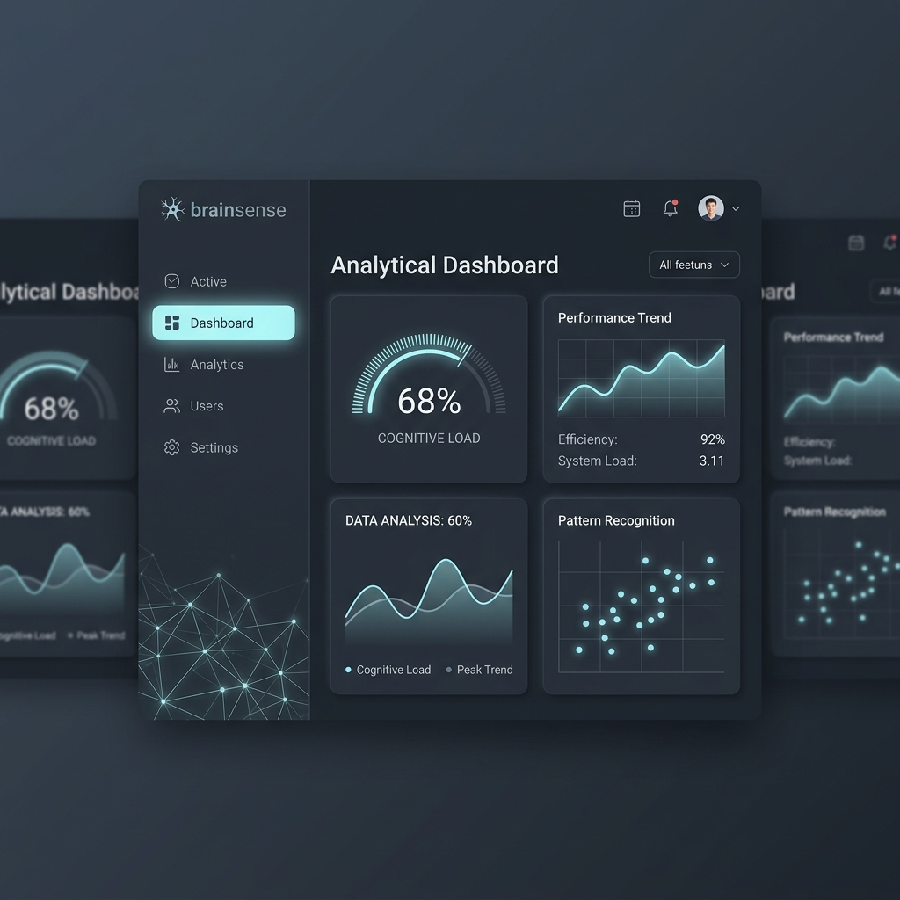
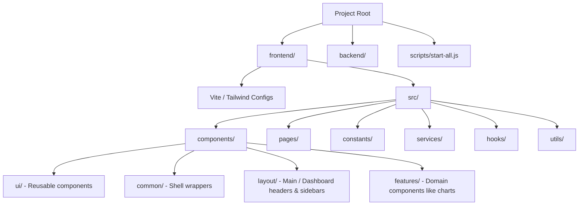

# Walkthrough - BrainSense Premium UI Redesign

We have successfully redesigned the entire BrainSense UI into a premium, futuristic analytics platform inspired by high-end dark interfaces (Apple Vision Pro, Stripe, Linear, Vercel, and advanced AI operating systems) while preserving 100% of the underlying business logic, routing structure, and backend APIs.

---

## Analytical Dashboard Visual Concept

---

## Architectural Changes

### 1. 3D Overlapping Workspace Layout
- Implemented a perspective layout wrapper inside [DashboardLayout.jsx](file:///c:/Users/devan/OneDrive/Desktop/BrainSense/frontend/src/components/layout/DashboardLayout.jsx).
- Positioned two stylized, blurred mock panels flanking the active center window (`rotateY(16deg)` and `rotateY(-16deg)`) to create spatial depth.
- Styled all panel cards using a frosted glass backdrop (`rgba(255,255,255,0.03)` with thin `rgba(255,255,255,0.08)` borders) and a large `rounded-[24px]` border radius.

### 2. Apple-Style Pill Navigation & Neural Elements
- Configured active navigation links in [Sidebar.jsx](file:///c:/Users/devan/OneDrive/Desktop/BrainSense/frontend/src/components/layout/Sidebar.jsx) to render as capsules (`rounded-full`) with a soft cyan background highlight (`bg-[#6EE7FF]/12 text-[#6EE7FF]`) and a glow drop-shadow.
- Drafted a custom neuron-inspired SVG logo and placed a subtle connected node layout at the bottom of the sidebar operating at `4%` opacity.
- Updated [BackgroundEffects.jsx](file:///c:/Users/devan/OneDrive/Desktop/BrainSense/frontend/src/components/layout/BackgroundEffects.jsx) to restrict background tech SVGs strictly to `2% - 5%` opacity.

### 4. Vercel Monorepo Settings
- Updated [vercel.json](file:///c:/Users/devan/OneDrive/Desktop/BrainSense/vercel.json) configuration at the workspace root to include `"entrypoint": "frontend"` for the frontend project definition, preserving Vercel's automated builds and routing mappings.

### 3. Glassmorphic Top Navigation
- Added a workspace dropdown ("All Features") on the left of [Topbar.jsx](file:///c:/Users/devan/OneDrive/Desktop/BrainSense/frontend/src/components/layout/Topbar.jsx).
- Embedded a console search field, Calendar action icon, bell notification dot indicator, and dropdown-enabled profile avatar.

### 4. 2x2 Custom Analytics Dashboard
- Refactored [DashboardPage.jsx](file:///c:/Users/devan/OneDrive/Desktop/BrainSense/frontend/src/pages/DashboardPage.jsx) to display a beautiful 2x2 widget layout:
  - **Widget 1 (Cognitive Load)**: A semi-circular radial arc gauge displaying `68%` load with an ambient cyan glow.
  - **Widget 2 (Performance Trend)**: An animated Recharts line chart mapping weekly efficiency, coupled with an inline stats section (*Efficiency: 92%*, *System Load: 3.11*, *Response Time: 0.2ms*).
  - **Widget 3 (Data Analysis)**: A waveform AreaChart comparing *Cognitive Load* and *Peak Trend* over a transparent double gradient, displaying an aggregate rate of `60%`.
  - **Widget 4 (Pattern Recognition)**: A futuristic scatter plot rendering cluster points over a fine coordinate grid.

---

## Verification Results

### Development Environments Boot
- Command: `npm run dev` at the workspace root.
- **Result: Successful initialization of both environments:**
  - **Backend**: Spawns FastAPI at `http://127.0.0.1:8000`.
  - **Frontend**: Spawns Vite at `http://localhost:5175/` (automatically resolving port conflicts).

### Production Build
We verified compilation correctness by compiling the frontend using Vite inside the new `/frontend` directory:
- Command: `cd frontend; npm run build`
- **Result: Successful compilation with zero errors.**
- Output Bundle:
  - HTML: `dist/index.html` (0.53 kB)
  - CSS: `dist/assets/index-BQzWyfEN.css` (24.34 kB)
  - JS: `dist/assets/index-BRhhDt86.js` (767.70 kB)
